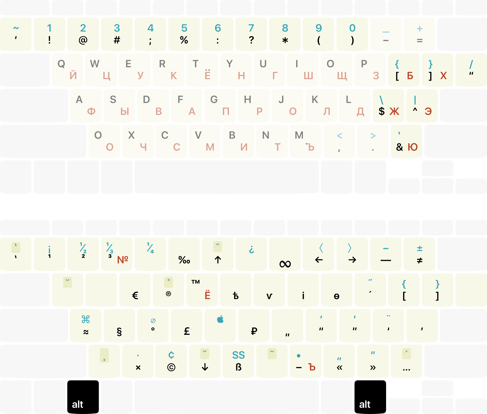
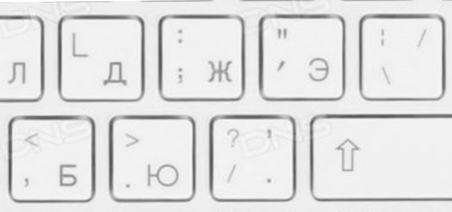
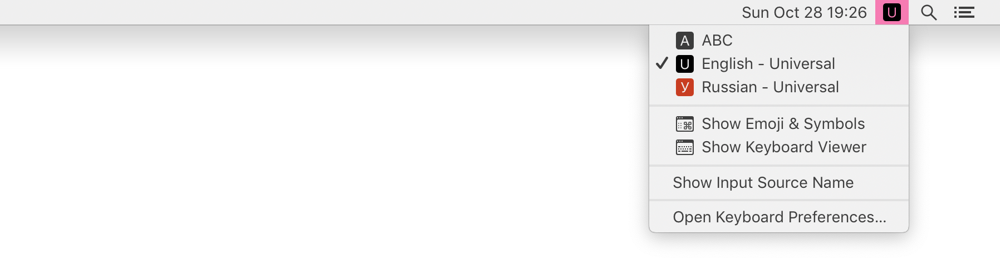

Универсальная раскладка — пакет из английской и русской раскладок для Мака, спроектированных для удобного совместного использования.

Распечатайте и держите под рукой эту шпаргалку на первое время, пока не привыкнете, где что.

### Что не так со стандартными?

Стандартная русская раскладка проектировалась по остаточному принципу исходя из условия, что латинскую менять нельзя. Это привело к тому, что в русской раскладке пунктуация (запятая, точка, двоеточие, точка с запятой, кавычка, вопрос) расположена на других местах, нежели в английской. Это очень путает, если вы регулярно пользуетесь обеими. А кое-что в русской раскладке и вовсе нельзя набрать, например, одинарную кавычку.

Надписи на кнопках тоже не сильно спасают. Попробуйте разобраться, что тут происходит:

Вот как [выкручиваются люди](https://twitter.com/Re_VKolesnikov/status/1055957736066899969):

> Рыдал. Все те же проблемы испытываю постоянно, вплоть до машинального переключения на анг. для набора знаков препинания.

Подробнее см. [Правильная русская клавиатура](https://tonsky.livejournal.com/318571.html) и [Артемий Лебедев. Трагедия запятой](https://www.artlebedev.ru/kovodstvo/sections/105/)

### Что предлагается?

- Две раскладки, Английская Универсальная и Русская Универсальная.
- Вся пунктуация стоит на одних и тех же местах в обеих раскладках.
- Цифры вынесены на ряд с шифтом, символы — на ряд без шифта (как в Русской — Машинописи).
- Запятая, точка, восклицательный знак, вопрос, точка с запятой, двоеточие, двойная и одинарная кавычки на дефолтном слое (без шифта).
- Насколько возможно, сохранена совместимость со стандартной English (88%) и Russian — PC (86%).
- В русской раскладке подвигались Б, Х и Ю — не пугайтесь.
- Встроена [Типографская раскладка Бирмана](https://ilyabirman.ru/projects/typography-layout/) (с добавлением Ё, Ъ и №).

### Как установить?

1. Скачайте [дистрибутив (последняя версия 1.3)](https://github.com/tonsky/Universal-Layout/releases/download/1.3/UniversalLayout_1.3.zip).
2. Кидаете `Universal.bundle` в `~/Library/Keyboard Layouts`.
3. `System Preferences...` → `Keyboard` → `Input sources` → добавляете «English - Universal» и «Russian - Universal».
4. Если у вас тёмная тема или тёмный статус бар, вместо них выберите `Dark` версии (отличаются только иконками).
5. Возможно, понадобится сделать Logout-Login.

### — Не понимаю, зачем это мне?

Набирать частотные символы без шифта или переключения в другую раскладку очень сильно разгружает руки, приносит приятное чувство комфорта и увеличивает скорость набора. Если вы связали свою жизнь с компьютерами, имеет смысл вложиться в оптимально спроектированный инструмент и правильные привычки, которые окупят себя десятикратно.

### — Я попробовал и это очень неудобно!

Так просто начать пользоваться новой раскладкой (любой), как и новой клавиатурой, не получится. Как человек, уже переучивший себя на пару принципиально нестандартных клавиатур, сменивший не один текстовый редактор (новые горячие клавиши) и периодически экспериментирующий над собственными раскладками, хочу сказать — первым ощущениям нельзя верить. Неудобно только первую неделю, нужно заставить себя и перетерпеть, зато потом начинается кайф. Про опыт переучивания привычек см. также [Overriding Your Habits](http://tonsky.me/blog/cursor-keys/#important-overriding-your-habits).

### — Зачем вынесли цифры на шифт?

Это связано с тем, что цифры набираются _гораздо_ реже, чем пунктуация и специальные символы в коде. Подробнее мотивацию и эксперименты см. [Навык привычки](https://tonsky.livejournal.com/299326.html). Этот же прием используется в раскладках Typewriter (Машинопись), которыми многие пользуются.

### — Надписи на кнопках теперь все перепутаны!

Да, но с этим можно жить. Люди без особых проблем набирают русский текст на английских клавиатурах и на клавиатурах вообще без подписей. Учитесь не смотреть на клавиатуру и всё получится.

### — Я не смогу работать на других компьютерах!

Я работаю за нестандартными клавиатурами и раскладками с 2013 года. Когда мне приходилось часто переключаться, я мог одинаково свободно работать за любыми раскладами. Когда я стал работать преимущественно за одним компьютером и одной раскладкой, этот навык потерялся, но как показала практика, проблема сильно преувеличена — работать за чужими компьютерами приходится не так уж и часто.

### — Всё нравится, но я хочу Dvorak (Colemac, Workman, Azerty, Русскую фонетическую или ещё что-то)

Я ими не пользуюсь (возможно, пока), так что их нет. Но раскладка касается в основном только знаков препинания, расклад же букв может быть любой. Скачайте мою раскладку, откройте в [Ukelele.app](http://scripts.sil.org/ukelele) и доведите до нужного состояния. Сделать это очень просто.

### — Я переживаю за Ё! (или за Ъ, или за №)

Они никуда не делись, просто переехали в типографский слой (Alt + Е, Alt + Ь, Alt + 3) как [самые низкочастотные буквы](https://ru.wikipedia.org/wiki/%D0%A7%D0%B0%D1%81%D1%82%D0%BE%D1%82%D0%BD%D0%BE%D1%81%D1%82%D1%8C).

### — Есть ли поддержка Windows?

Нет, и не планируется. Тут как-нибудь сами.

### Титры

Copyright © 2018 Никита Прокопов

Лицензия [MIT](https://github.com/tonsky/Universal-Layout/blob/master/LICENSE)

Твиттер [@nikitonsky](https://twitter.com/nikitonsky)

Патреон [patreon.com/tonsky](https://patreon.com/tonsky)
